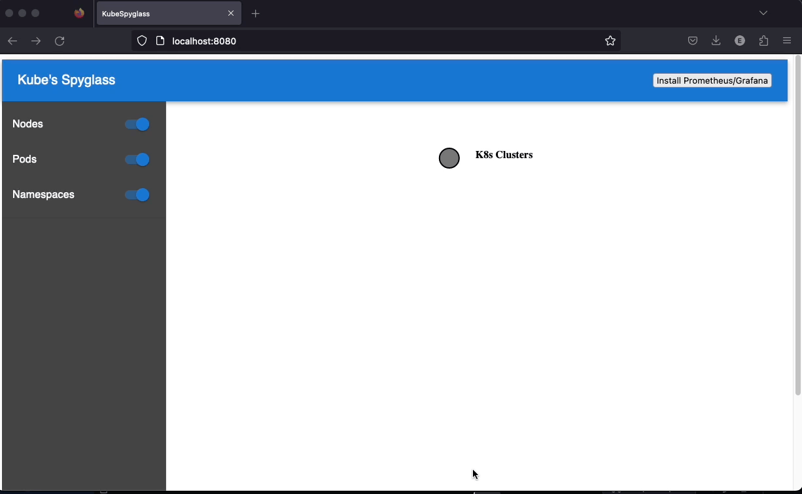
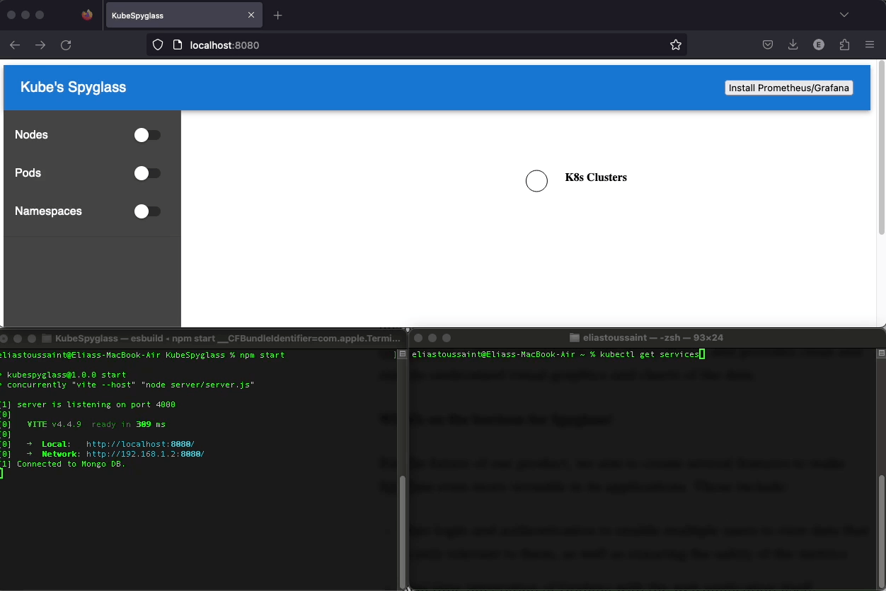

# (Kube)Spyglass

# Technology Stack 

  
  
  
  
  
  
  
  
   
  
  
  
  
  
  

# Introduction
In an era of technological advancements, it is important to remember that hardware is just as important a part of the process as software. Maintaining the health of your system at optimal levels can help keep costs and interruptions at a minimum, while ensuring maximal performance and longevity. There exist several fantastic tools which can provide the information necessary for this monitoring, but where they excel in effectiveness, they are also weighed down by the sheer quantity of data they provide. With an incredibly large array of complex metrics to choose from and parse, it can be a daunting and exhausting task simply to set up the monitoring. 
 
 
In order to make this process simpler and more efficient to interface with, we have developed KubeSpyglass (heretofore referred to as Spyglass). Spyglass aims to provide a clean, simple user experience which will enable users to seamlessly install a suite of monitoring and visualization tools on their systems without needing to go through the hassle of configuring it themselves. But how does it do this?
 
 
Spyglass is built to operate on systems running Kubernetes container orchestration. Spyglass provides threefold utility in the form of a simple visualization of the Kubernetes cluster structure, a lightweight monitoring visualization of four core Kubernetes system metrics, and a one-button installation process for both Prometheus and Grafana.

# Features
## User features

The Spyglass tool is designed to streamline and enhance your experience with Kubernetes cluster management. We offer tools to:
* visualize the structure of your Kubernetes cluster
* monitor key performance metrics accross your cluster 
* alert you to critical conditions in key health metrics. 

Choose the tool most suited for your needs: 
 

  

 

Spyglass comes with two options for Kubernetes metric monitoring. 
* A fast ultra-lightweight monitoring option using core API metrics. 
* A powerful comprehensive monitoring option using Prometheus and Grafana. 

It also comes with a helpful GUI to view and interact with your Kubernetes Cluster Structure and display:
* Nodes
* Services
* Namespaces
* Pods
* Containers 
* Ports
* Essential connections

## Developer features
Comprehensive Testing Suite: Spyglass's testing suite (using Jest, Supertest, and React Testing Library) enables future developers to assess code functionality throughout the frontend and backend of the application.

## Security
User interactions with you Kubernetes instance are secured with BCrypt, HTTPS, and Kubernetes ClusterRole security, so you can rest assured that your cluster information stays secure.

# User Experience 

## Visualize the Structure of your cluster

## Seamlessly install prometheus and grafana

## Visualize your metrics with grafana visualizations

# Anticipated Release

Spyglass 1.0 is forthcoming and will likely be released later this year. Stay tuned for further announcements. 

# Requirements
Requires Helm v.3.12.0  
Please free up the following ports:
Technology  | Port Number
------------- | -------------
Grafana  | 3000
server | 4000
Spyglass  | 8080

# Publications
Read our Medium Article [Here]('')!